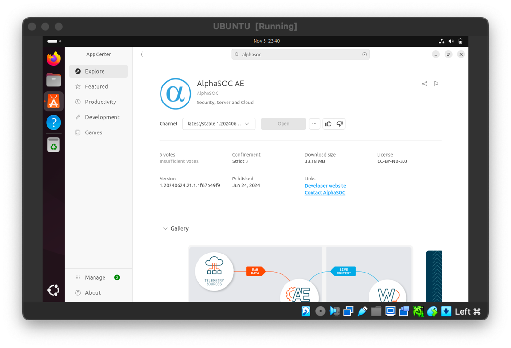
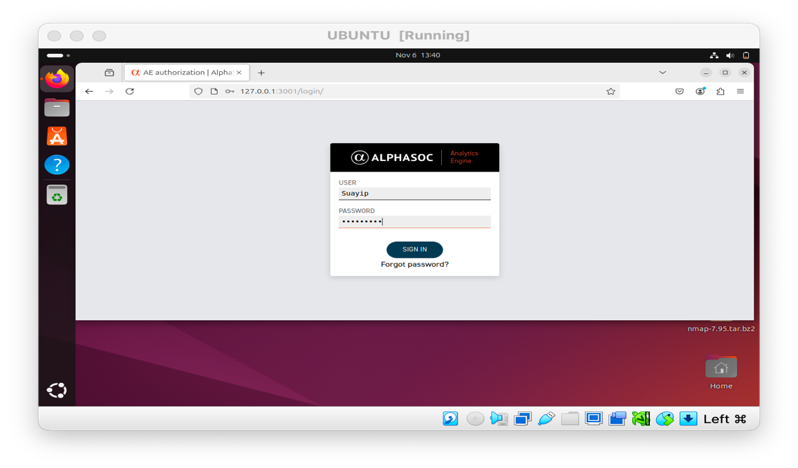
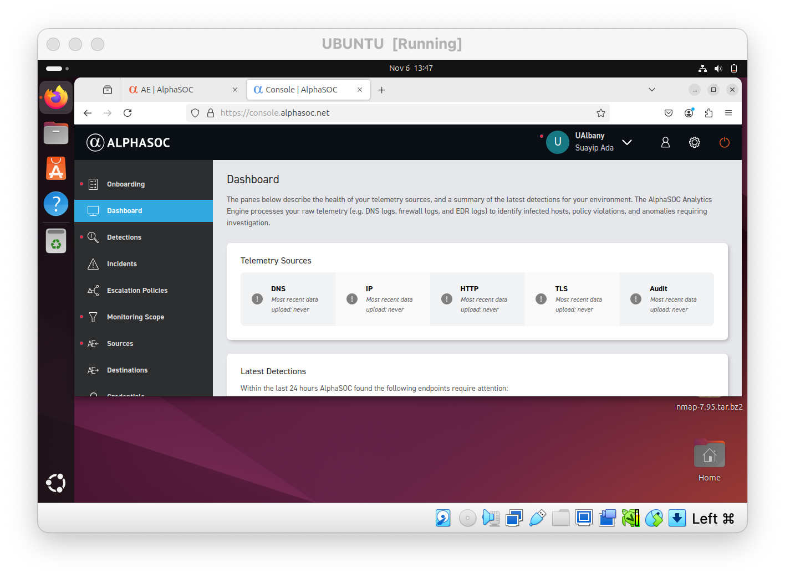
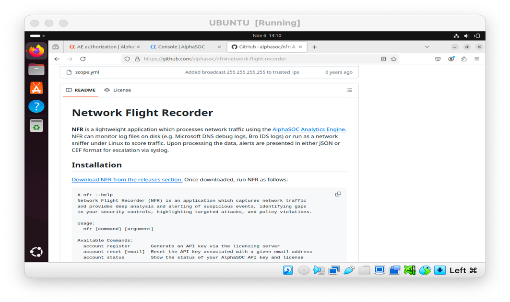
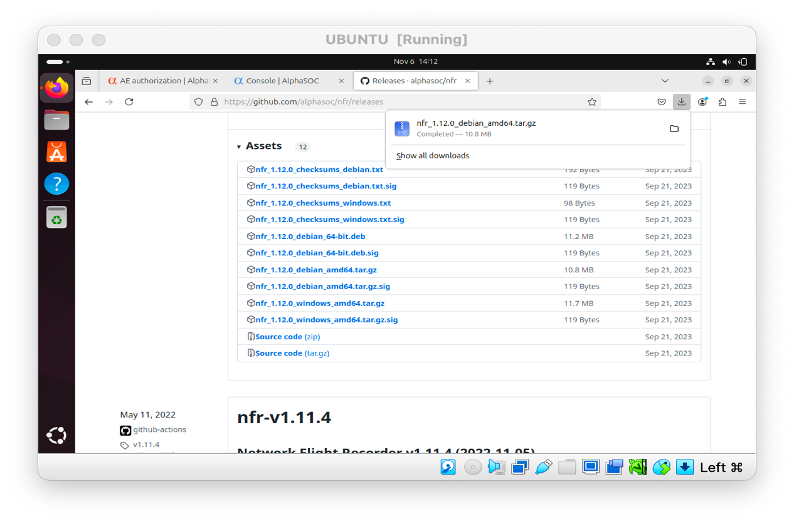
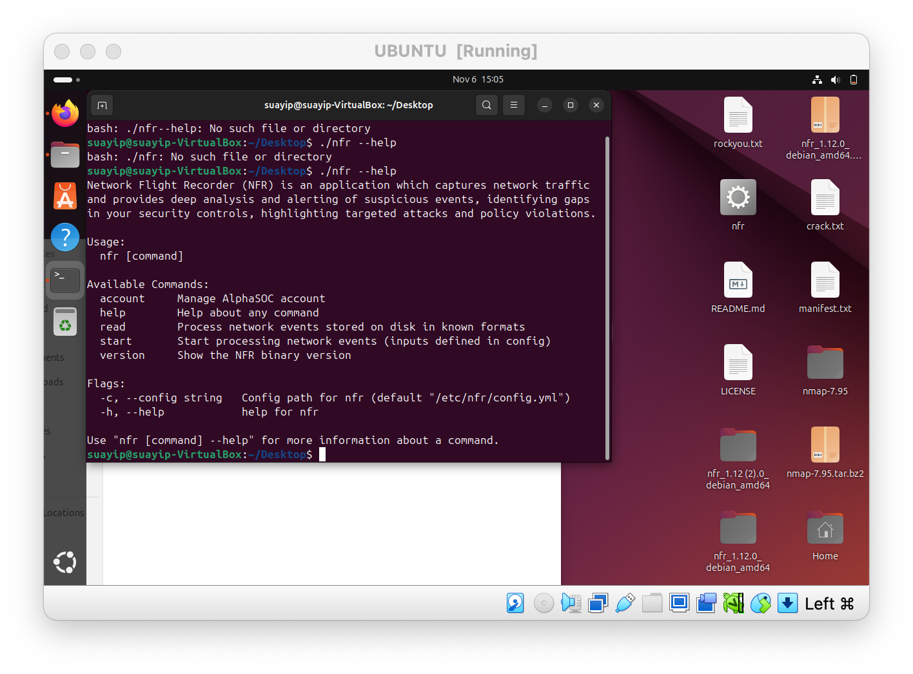
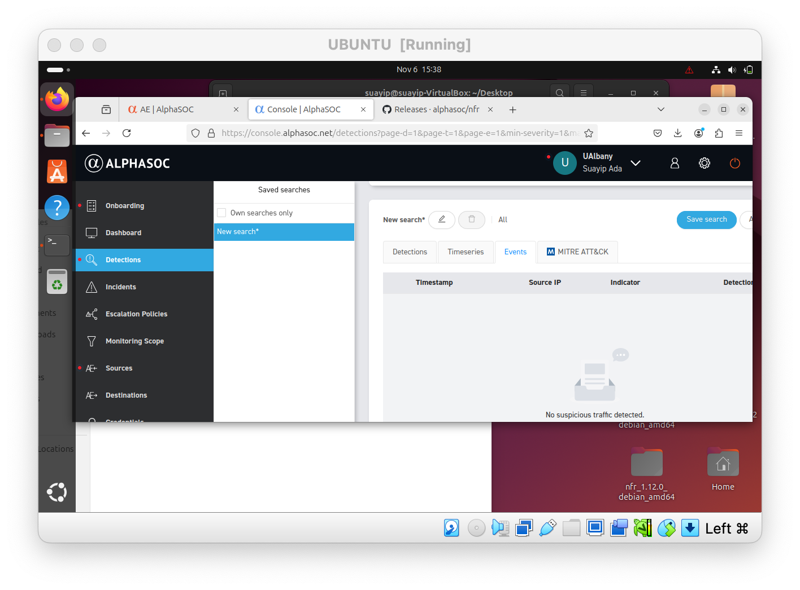

# AlphaSOC SIEM & Network Monitoring Lab

A hands-on cybersecurity lab using **AlphaSOC Analytics Engine** and **Network Flight Recorder (NFR)** in an Ubuntu virtual machine to practice SIEM setup, telemetry-source configuration, API-based integration, and troubleshooting.

> **Scope note:** this repository documents an academic lab and the configuration work I completed. I successfully installed and configured AlphaSOC AE, generated and applied API credentials, installed NFR, verified the NFR binary, and registered NFR. The final step—confirming network events in the AlphaSOC console—was not conclusively verified, so this repository does not claim successful end-to-end telemetry ingestion.

## What I worked on

- Installed **AlphaSOC Analytics Engine** in an Ubuntu VM
- Configured local AlphaSOC AE administrative credentials
- Accessed the AlphaSOC AE web UI on `127.0.0.1:3001`
- Created an AlphaSOC console account
- Generated an AlphaSOC API key and applied it to the local AE configuration
- Applied configuration changes and restarted services
- Downloaded and extracted **Network Flight Recorder (NFR)**
- Verified NFR installation with `./nfr --help`
- Registered NFR through its account workflow
- Troubleshot file-location, execution, and setup issues during installation

## Environment

- Ubuntu virtual machine
- VirtualBox
- AlphaSOC Analytics Engine
- AlphaSOC Console
- Network Flight Recorder (NFR)
- Firefox
- Linux terminal

## Lab workflow

### 1. Install AlphaSOC Analytics Engine

AlphaSOC AE was installed inside the Ubuntu VM.



### 2. Configure the local AlphaSOC AE UI

Administrative credentials were configured from the terminal, then the local UI was opened at:

```text
http://127.0.0.1:3001
```



### 3. Configure AlphaSOC console access

I created a console account and generated API credentials used to link the local AlphaSOC AE environment with the console.

> API keys and credential screenshots are intentionally excluded from this repository.



### 4. Download and install Network Flight Recorder

NFR was downloaded for the Ubuntu environment and extracted locally.





### 5. Verify NFR from the terminal

I initially ran into file-path and execution issues. After moving to the correct directory and invoking the binary properly, `./nfr --help` returned the NFR command interface.



This confirmed that the NFR executable was available and runnable in the VM.

### 6. Register NFR

The NFR account-registration process was completed using the account workflow described in the lab.

Credential output is not included in this repository.

### 7. Attempt to verify network events

The final lab step instructed me to return to AlphaSOC and inspect network events in the UI.

At that point, I could not confidently confirm that new telemetry or network events were appearing. Rather than overstate the outcome, I documented the uncertainty and stopped short of claiming successful event ingestion.



## Troubleshooting performed

This lab involved several practical troubleshooting steps:

- correcting the NFR extraction location;
- identifying the proper working directory;
- resolving `No such file or directory` errors;
- determining how to execute the NFR binary from the terminal;
- validating installation with the built-in help command; and
- working through differences between the written lab instructions and the current AlphaSOC interface.

One example:

```bash
./nfr --help
```

Initially failed when I was not in the correct directory. After moving to the appropriate location and rerunning the command, NFR displayed its available commands and options.

## What this demonstrates

This project demonstrates exposure to:

- SIEM configuration concepts
- telemetry-source integration
- Linux command-line troubleshooting
- API-key based service configuration
- virtualized security lab environments
- network-monitoring tooling
- security-console navigation
- documenting incomplete or uncertain results accurately

## What I learned

The most important lesson from this lab was that security tooling often requires more than simply following installation steps. File paths, permissions, binary execution, service configuration, API credentials, and interface changes can all affect whether a monitoring pipeline works as expected.

I also learned the importance of distinguishing between:

- **installing a tool successfully**,
- **configuring an integration**, and
- **verifying that telemetry is actually flowing**.

Those are separate validation stages.

## Limitations

- This was an academic lab, not a production SIEM deployment.
- The lab used an Ubuntu VM rather than an enterprise network.
- API keys and credentials are intentionally excluded.
- Final event ingestion into AlphaSOC was not conclusively verified.
- The screenshots reflect the software/interface available at the time the lab was completed.

## Future improvements

If I rebuild this lab, I would:

- verify AlphaSOC/NFR version compatibility;
- document service status with terminal output;
- capture NFR configuration files with secrets redacted;
- generate known benign test traffic;
- confirm telemetry arrival with timestamps;
- document one complete event from source to SIEM;
- record troubleshooting steps in a reproducible command log.

## Repository structure

```text
alphasoc-siem-network-monitoring-lab/
├── README.md
├── LEARNING_NOTES.md
├── .gitignore
└── screenshots/
    ├── 01-alphasoc-installed.png
    ├── 02-alphasoc-admin-login.png
    ├── 03-alphasoc-console-dashboard.png
    ├── 04-nfr-project-page.png
    ├── 05-nfr-release-download.png
    ├── 06-nfr-help-output.png
    └── 07-alphasoc-console-final-view.png
```

## Academic context

This repository is a cleaned portfolio version of a cybersecurity course lab. It is intended to show the setup, integration, troubleshooting, and documentation work I performed without overstating the final result.
